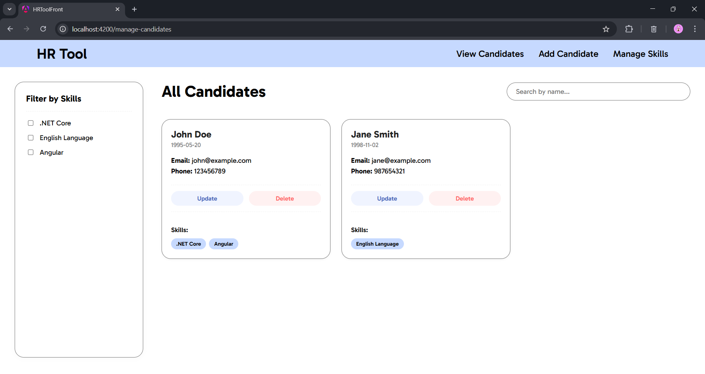
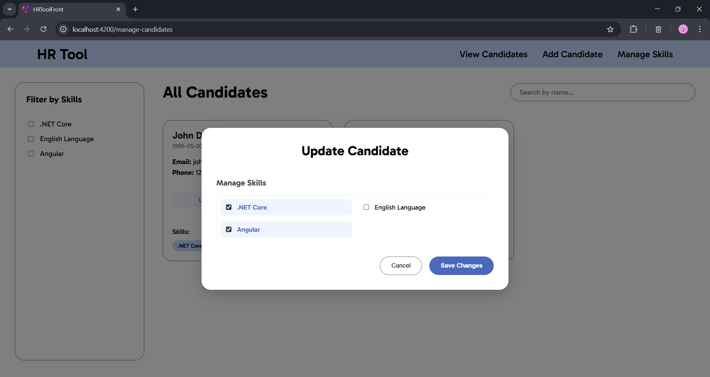
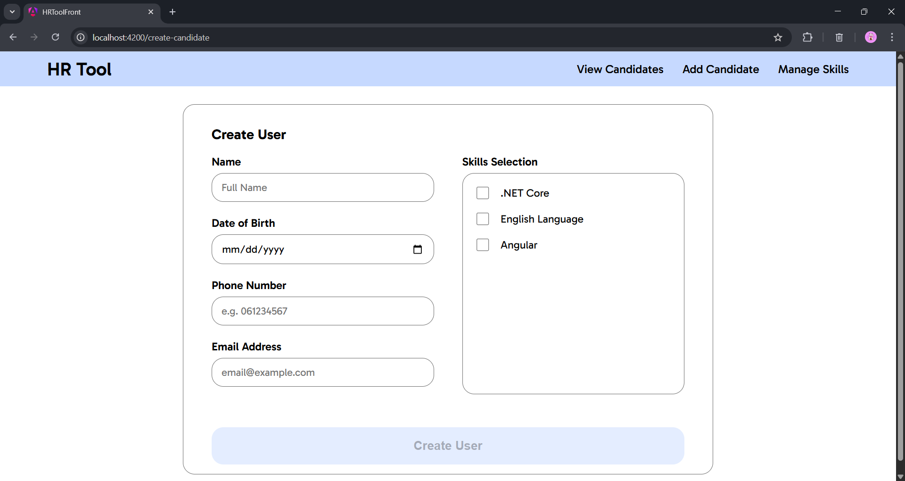

# HR Tool

The most demanding part was the search and filtering. I designed it so that the frontend sends optional query parameters for the name and skill IDs in the HTTP request. In the Service layer, I used LINQ to build the query, which ensures the filtering happens at the database level. This avoids pulling the whole dataset into memory and improves performance. All of the querying and mapping was done using LINQ as well.

---

--- 

This repository contains the implementation of the following API:

**[GET] /api/candidates** (opt name, opt skill ids) 
- Filters all of the candidates by name or skills
- Returns 200 OK / 204 No Content if successful

**[POST] /api/candidates** 
- Creates a new candidate (201 Created on success)
- 400 Bad Request - If the request doesn't fit the constraints

**[PUT] /api/candidates/{id}** (req skill ids)
- Used for updating a candidates skill set, either removing or adding them 
- 404 Not Found - If the id does not exist in the database

**[DELETE] /api/candidates/{id}**
- Deletes a candidate with the given id
- 404 Not Found - If the id does not exist in the database

**[GET] /api/skills**
- Retrieves all skills from the system

**[POST] /api/skills**
- Creates a new skill

**[DELETE] /api/skills/{id}**
-   Deletes a skill with the given id
